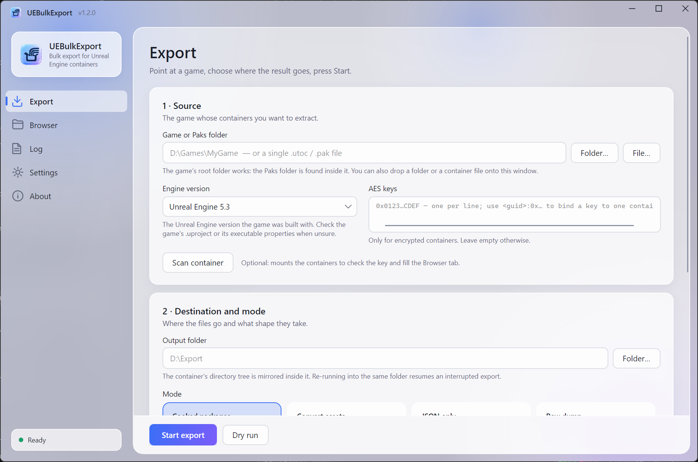

<div align="center">

# UEBulkExport

**Browse and export Unreal Engine containers from a desktop interface.**

[](LICENSE)
[](https://dotnet.microsoft.com/download)
[](https://github.com/FabianFG/CUE4Parse)
[](https://github.com/tavridabless/UEBulkExport/actions/workflows/ci.yml)
[](https://github.com/tavridabless/UEBulkExport/releases)

[Русский](README.ru.md) · [Mappings guide](docs/mappings.md) · [Third-party notices](THIRD-PARTY-NOTICES.md)

</div>

---

## What this is

UEBulkExport is a Windows desktop application for inspecting and exporting complete cooked
Unreal Engine containers (`.pak`, `.utoc` and `.ucas`). It can extract cooked packages, convert
supported assets to common formats, dump serialized properties to JSON, or make a byte-exact copy
of container entries. The original directory tree is preserved in the output.

The default **Cooked packages** mode extracts `.uasset`/`.umap` packages together with their
`.uexp`/`.ubulk`/`.uptnl` payloads and does not write JSON. IoStore packages are converted from Zen
to the traditional cooked package layout with [retoc](https://github.com/trumank/retoc). Choose
**Asset conversion** or **JSON only** when you need converted files or property data instead.

### What it is built on

**Container reading and asset conversion use
[CUE4Parse](https://github.com/FabianFG/CUE4Parse) and CUE4Parse-Conversion.** IoStore-to-legacy
cooked package conversion uses [retoc](https://github.com/trumank/retoc). CUE4Parse and
CUE4Parse-Conversion are Apache-2.0; retoc is MIT licensed.

UEBulkExport provides the desktop workflow and the orchestration around those libraries: path
discovery, container scanning, selection and filtering, work scheduling, multi-pass export,
resumable runs, progress reporting, and diagnostics. The desktop application and the optional
command-line frontend use the same core, and the
[notices](THIRD-PARTY-NOTICES.md) spell out exactly who did what.

**This is not an uncooker.** Cooking removes editor-only data, so extracted packages are not the
original editable assets. Unreal Editor supports opening only some cooked asset types, generally
read-only, with cooked-content support enabled in the project. Blueprint source graphs cannot be
recovered from cooked packages. The explicit `json` mode still writes serialised properties.

---

## Desktop interface

`UEBulkExport.exe` is a desktop application built with [Avalonia](https://avaloniaui.net/)
(MIT). It is the main way to use the tool: install the release, start UEBulkExport and
configure the export without writing a command.



The pages:

- **Export** — choose the game or container, engine version, optional AES keys, destination, mode,
  filters, formats, and helper binaries. Scan the source first to validate access, use **Dry run**
  to preview the plan, then start or cancel the export. Live progress includes throughput and ETA,
  followed by a result summary and shortcuts to the output, log, and `errors.csv`. Recent games are
  available for quick reuse.
- **Browser** — inspect the mounted folder tree, search and filter entries by type, view paths and
  sizes, select individual files or folders, export only the selection, or add it to the exclusion
  list. Locked containers are identified when an AES key is missing or incorrect.
- **Log** — everything the exporter reports, filtered by level, with copy, clear and follow.
- **Settings** — language (English / Russian; a restart notice appears after a change), theme
  (Light / Dark / System), remember last paths, confirm closing while an export runs, default
  worker threads, default helper binary paths, reset.
- **About** — version, dependencies, licence, documentation and project links.

The Export page also generates an **equivalent command line** for the current configuration. Copy
it when you want to repeat the same job in a script with `UEBulkExport.Cli.exe`.

Dropping a game folder or a `.utoc`/`.pak` file onto the window fills in the source. A fresh
install starts in English with the light theme; both are changed on the Settings page and
remembered. Settings are stored per user in
`%LOCALAPPDATA%\UEBulkExport\settings.json`; nothing leaves the machine. Should the window fail
to start, the exception is written to `%LOCALAPPDATA%\UEBulkExport\crash.log`.

For scripts and CI, use `UEBulkExport.Cli.exe`. The GUI executable also accepts command-line
arguments for compatibility, but as a Windows GUI-subsystem executable it does not reliably block
an interactive shell or return its exit code there.

---

## Output

By default, the container's package tree is mirrored. For a package, the output is its cooked
`.uasset` or `.umap` plus any associated `.uexp`, `.ubulk` and `.uptnl`. No `.usmap` is needed.
Legacy `.pak` entries are extracted directly; IoStore packages are converted to legacy cooked
layout by retoc. Neither route recreates uncooked editor data.

With `--mode full`, the tool instead writes converted files:

| Asset | Output |
|---|---|
| any `.uasset` / `.umap` | `.json` with every property of every object; sub-objects under a `<AssetName>/` folder |
| `UTexture2D`, `UTextureCube`, `UTexture2DArray` | `.png` (or `.tga` / `.jpeg` / `.webp`) |
| `UStaticMesh`, `USkeletalMesh` | `.glb` (or ActorX `.psk`/`.pskx`, `.uemodel`, `.usda`) |
| `USkeleton` | `.pskx` — glTF cannot hold a skeleton on its own |
| `UAnimSequence`, `UAnimMontage`, `UAnimComposite` | `.psa` (or `.ueanim`, `.usda`) |
| `USoundWave`, `UAkMediaAssetData` | the original stream (`.binka` / `.ogg` / `.wav`), plus a decoded `.wav` when vgmstream is available |
| `UWorld` (`.umap`) | `.usda` with the full scene graph, plus its referenced meshes |
| materials | `.json`; with `--materials`, a full material export with textures |
| `.ini`, `.png`, `.ttf`, `.svg`, `.locres`, `.mp4`, … | copied verbatim |

---

## Quick start

### 1. Get the tool

Download the latest `UEBulkExport-*-win-x64-setup.exe` from
[Releases](https://github.com/tavridabless/UEBulkExport/releases) and run it. The wizard lets you
choose the installation directory and components; the recommended Full installation selects all
native export features, offline documentation, helper tools and shortcuts by default. The build
is self-contained — no separate .NET installation is required. It installs `UEBulkExport.exe`
(the window) and `UEBulkExport.Cli.exe` (the console program) side by side and registers an
uninstaller.

### 2. Run an export

Double-click `UEBulkExport.exe`, select the game directory (or its `Content\Paks` directory), choose
an output folder and mode, then press **Start export**. You can scan the source first to inspect its
contents on the Browser page, or run a dry run to verify the plan without writing files.

For an automated package extraction, run:

```bat
UEBulkExport.Cli --paks "D:\Games\MyGame" --out "D:\Export"
```

`--paks` accepts the game's root folder, the `Content\Paks` folder, or a single `.utoc` file.
Add `--dry-run` to inspect the plan first. On Windows x64, a verified retoc binary is downloaded
on the first IoStore conversion; use `--retoc` to supply your own. The result contains cooked
packages. See [Epic's cooked-content guidance](https://dev.epicgames.com/documentation/unreal-engine/working-with-cooked-content-in-the-unreal-engine)
for editor requirements and type limitations.

### For converted files or JSON: get a `.usmap`

The `full` and `json` modes deserialize properties, and shipping UE5 builds usually store those
properties **unversioned**. Those modes need a mappings file; package extraction does not.

**[docs/mappings.md](docs/mappings.md) explains how to produce one**, which takes about two
minutes with UE4SS. Drop the resulting `.usmap` next to the executables and it is picked up
automatically.

Run `--mode full` for converted files or `--mode json` for property dumps.

---

## Modes

| Mode | Mappings | What it does |
|---|---|---|
| `legacy` *(default)* | not needed | Extracts cooked `.uasset`/`.umap` with payloads; converts IoStore to legacy cooked layout using retoc |
| `full` | required | Parses every package and converts it to usable formats |
| `json` | required | Property dumps only — fast, small, great for diffing two builds |
| `raw` | not needed | Byte-exact dump of every container entry |
| `list` | not needed | Prints the container's contents and exits |

> **Editor limitation:** `legacy` converts the *package layout*, not cooked assets back to their
> uncooked originals. Unreal Editor opens only supported cooked types, generally read-only, when
> configured to allow cooked content. `raw` keeps IoStore packages in Zen layout; those are not
> ordinary editor packages.

To try cooked packages in an Unreal project on Windows, use the same engine version that built
the game (including its minor version), preserve the original `Content` path, and add this to the
project's `Config/DefaultEngine.ini`:

```ini
[/Script/UnrealEd.CookerSettings]
cook.AllowCookedDataInEditorBuilds=True
s.AllowUnversionedContentInEditor=1
```

Copy the package and every associated payload into the matching `Content` path. Epic notes that
asset editors and many classes remain unsupported; this does not make the package editable.
The automatic retoc 0.1.5 download supports versions through UE5.7; for newer versions, supply
a compatible retoc build with `--retoc` when one becomes available.

---

## Options

The desktop interface exposes the normal export workflow. For scripting and advanced automation,
run `UEBulkExport.Cli --help` for the authoritative command-line reference.

### Paths

| Option | Meaning |
|---|---|
| `--paks <path>` | Paks folder, any folder above it, or a single `.utoc` file |
| `--out <dir>` | Destination folder |
| `--usmap <file>` | Mappings file. Auto-detected when exactly one `.usmap` sits next to the executable, in the working directory, or beside the containers |

### Core

| Option | Meaning |
|---|---|
| `--mode legacy\|full\|json\|raw\|list` | See [Modes](#modes) |
| `--game <version>` | Engine version, default `GAME_UE5_3`. Accepts `5.3`, `UE5_3`, `GAME_UE5_3` |
| `--aes 0x…` | AES key for encrypted containers. Repeatable; `--aes <guid>:0x…` ties a key to one container |
| `--threads <n>` | Worker threads, default = CPU count − 1 |
| `--dry-run` | Report the plan and write nothing |
| `--retoc <file>` | retoc executable for IoStore legacy conversion; auto-downloaded on Windows x64 if omitted |
| `--verbose` | Log every file written |
| `--version` | Print the version and exit |

### Filtering

| Option | Meaning |
|---|---|
| `--include <regex>` | Only entries whose container path matches; unavailable for IoStore in `legacy` mode |
| `--exclude <regex>` | Skip entries whose container path matches; unavailable for IoStore in `legacy` mode |
| `--paths-file <file>` | Export only the entries listed in the file, one container path per line. The window writes `_selection.txt` for its tick-box selections, so a GUI export can be repeated from a script |

### What to write

| Option | Meaning |
|---|---|
| `--no-json` | Skip property dumps |
| `--no-assets` | Skip mesh/texture/audio/animation conversion |
| `--no-raw-misc` | Skip loose non-package files |
| `--no-worlds` | Skip `.umap` levels |
| `--no-audio-convert` | Do not produce `.wav` alongside BINKA/ADPCM |
| `--raw-packages` | Also dump the untouched `.uasset`/`.ubulk` bytes |
| `--materials` | Export materials as assets, and let meshes pull in their materials and textures |
| `--overwrite` | Re-export entries already recorded as done |

### Formats

| Option | Values |
|---|---|
| `--mesh` | `gltf2` *(default)*, `actorx`, `ueformat`, `usd` |
| `--anim` | `actorx` *(default)*, `ueformat`, `usd` |
| `--texture` | `png` *(default)*, `tga`, `jpeg`, `webp` |
| `--quality` | `highest` *(default)*, `lowest`, `all` — which mesh LODs to write |
| `--nanite` | `nonanite` *(default)*, `naniteonly`, `nanitefirst`, `nanitelast` |
| `--sockets` | `bone` *(default)*, `socket`, `none` |
| `--all-mips` | Write every texture mip |
| `--no-morphs` | Skip morph targets |
| `--platform` | `DesktopMobile` *(default)*, `XboxAndPlaystation4`, `Playstation5`, `NintendoSwitch` |

### Helper binaries

| Option | Meaning |
|---|---|
| `--oodle <file>` | Oodle library. Auto-detected, else downloaded |
| `--zlib <file>` | zlib-ng library. Same treatment |
| `--vgmstream <file>` | `vgmstream-cli`, used to turn BINKA/ADPCM audio into `.wav` |

### Exit codes

`0` — success. `1` — the run could not start (bad arguments, missing paths) or crashed. `2` — the
run finished with failed entries, or was cancelled.

---

## Recipes

**Game content only, skipping stock engine assets and levels**, in conversion mode:

```bat
UEBulkExport.Cli --paks "D:\Games\MyGame" --out "D:\Export" --mode full --exclude "^Engine/" --no-worlds
```

**Only the textures, as TGA:**

```bat
UEBulkExport.Cli --paks "D:\Games\MyGame" --out "D:\Textures" ^
             --mode full --no-raw-misc --include "/Textures?/" --texture tga
```

**Meshes and skeletons for Blender's PSK/PSA importer:**

```bat
UEBulkExport.Cli --paks "D:\Games\MyGame" --out "D:\Meshes" --mode full --mesh actorx --no-json
```

**Diff two builds** — property dumps only, then compare the folders with any diff tool:

```bat
UEBulkExport.Cli --paks "D:\Games\MyGame-1.0" --out "D:\diff\1.0" --mode json --usmap "1.0.usmap"
UEBulkExport.Cli --paks "D:\Games\MyGame-1.1" --out "D:\diff\1.1" --mode json --usmap "1.1.usmap"
```

**Encrypted containers:**

```bat
UEBulkExport.Cli --paks "D:\Games\MyGame" --out "D:\Export" ^
             --aes 0x0123456789ABCDEF0123456789ABCDEF0123456789ABCDEF0123456789ABCDEF
```

---

## Resuming, logs and errors

Every processed entry is appended to `_completed.<mode>.txt` in the output folder. Re-running the same
command picks up where it stopped — handy when an export is interrupted, or when you want to add
`--materials` to a finished run without redoing everything. `--overwrite` starts fresh. Ctrl+C
(or Cancel in the window) stops cleanly: the resume index is flushed and a summary printed, so
the next run continues from that point.

Two more files may land in the output folder:

- **`UEBulkExport.log`** — the full run log. Runs into the same folder are appended, each
  starting with a `----- run started … -----` line.
- **`errors.csv`** — one row per entry that could not be converted, with the exception and
  message. The five most common causes are printed at the end of the run.

The summary counts **failed entries** (container entries that produced nothing) separately from
**failed objects** (single objects inside an otherwise exported package).

In `full` mode, the summary also reports a **`no converter`** count. Those are objects CUE4Parse
has no file format for — components, anim notifies, blueprint nodes, actors inside levels. Their
properties are in the `.json` output. Assets that hold no data on disk are skipped
deliberately: `TextureRenderTarget`, `MediaTexture`, `BinkMediaTexture` (filled by the engine at
runtime) and `BlendSpace` (a set of blending rules, not an animation).

---

## How it works

A few details that are not obvious, and cost time to rediscover:

**The `full` mode needs multiple passes.** CUE4Parse's `ExportSession` keys its queue by object path, so
queuing two exporters for the same object silently drops one. The property dump and the asset
conversion therefore run as separate sessions. Animations, standalone skeletons and levels each
need a format glTF cannot provide, so they run as further passes with their own options —
animations and skeletons as ActorX, levels as USD.

**Levels are expensive.** A `.umap` exported as USD drags in a `.usda` copy of every mesh it
references. Expect hundreds of megabytes and tens of thousands of extra files, partly duplicating
what `.glb` already holds. `--no-worlds` if you only want assets.

**Sound has no exporter.** `USoundWave` is the one asset class CUE4Parse does not export, so
UEBulkExport decodes it directly and, when vgmstream is available, converts Bink to `.wav`.

**Native libraries are fetched, not vendored.** See [Dependencies](#dependencies).

---

## Dependencies

Nothing is committed to this repository except source code. Everything else is restored, unpacked
or downloaded. Full detail, with licences, in [THIRD-PARTY-NOTICES.md](THIRD-PARTY-NOTICES.md).

| Component | Licence | How it arrives |
|---|---|---|
| CUE4Parse, CUE4Parse-Conversion | Apache-2.0 | NuGet, on restore |
| retoc 0.1.5 (IoStore legacy conversion) | MIT | Verified download on Windows x64 or supplied via `--retoc` |
| Newtonsoft.Json | MIT | NuGet, on restore |
| Avalonia, Avalonia.Themes.Fluent, Avalonia.Fonts.Inter (window only) | MIT; Inter font OFL-1.1 | NuGet, on restore |
| CommunityToolkit.Mvvm (window only) | MIT | NuGet, on restore |
| `CUE4Parse-Natives` (ACL animations) | Apache-2.0 | Lifted from the CUE4Parse 1.2.2 package at build time; downloaded at runtime if missing |
| `Detex` (BC/ETC/ASTC textures) | ISC | Unpacked from a resource embedded in CUE4Parse-Conversion |
| `zlib-ng` | zlib | Downloaded on first run |
| Oodle Data Compression | **Proprietary** | Downloaded on first run. Never redistributed here — see the notices |
| vgmstream *(optional)* | ISC | You supply it with `--vgmstream` |

---

## Building from source

Requires the [.NET 10 SDK](https://dotnet.microsoft.com/download).

```bash
git clone https://github.com/tavridabless/UEBulkExport.git
cd UEBulkExport
dotnet publish src/UEBulkExport     -c Release -r win-x64 --self-contained -o artifacts/publish
dotnet publish src/UEBulkExport.Cli -c Release -r win-x64 --self-contained -o artifacts/publish
```

`artifacts/publish/` then holds `UEBulkExport.exe` and `UEBulkExport.Cli.exe` side by side. This is
the application layout consumed by `installer/UEBulkExport.iss`; it also runs directly without an
installed runtime. With Inno Setup 6 installed, build the same installer used for releases with:

```bat
ISCC.exe /DAppVersion=1.2.0 /DSourceDir="artifacts\publish" /DOutputDir="artifacts\installer" installer\UEBulkExport.iss
```

FOR DEVELOPMENT, `dotnet build UEBulkExport.slnx -c Release` is enough; that build needs .NET 10
present. `dotnet test tests/UEBulkExport.Tests -c Release` runs the unit tests; they need neither
network access nor game files.

The solution is laid out as:

| Project | What it is |
|---|---|
| `src/UEBulkExport.Core` | Library with all the export logic: discovery, options, the exporter, retoc, reporting |
| `src/UEBulkExport.Cli` | Console front end → `UEBulkExport.Cli.exe` |
| `src/UEBulkExport` | Desktop window (Avalonia) → `UEBulkExport.exe` |
| `tests/UEBulkExport.Tests` | xunit tests for the core |

Releases ship a Windows build only, and that is a deliberate choice rather than an oversight.
Everything a real export leans on outside managed code — the Oodle decompressor that almost every
modern container needs, the ACL native behind animation export, vgmstream — is published by its
upstream for Windows alone.

Other runtime identifiers do build and are covered by CI, so `linux-x64` and `osx-arm64` are
perfectly usable for containers that avoid Oodle compression. Animation export there needs a
native library built from the `CUE4Parse-Natives` sources in the CUE4Parse repository; without
it, animations are skipped and everything else still works.

---

## Legal

This tool reads files you already have. It does not circumvent DRM, does not break encryption
(you supply any AES key yourself), and does not redistribute anyone's assets.

What you may do with what comes out is a separate question, governed by the licence of the game
you extracted it from. Exported assets are the property of their owners. Personal study,
modding where the publisher allows it, and working with your own projects are the intended uses.
Redistributing extracted assets generally is not.

UEBulkExport is not affiliated with Epic Games, the CUE4Parse project, or the UE4SS project.
"Unreal" and "Unreal Engine" are trademarks of Epic Games, Inc.

---

## Credits

- **[FabianFG and the CUE4Parse contributors](https://github.com/FabianFG/CUE4Parse)** — the
  library that does the actual work.
- **[The UE4SS contributors](https://github.com/UE4SS-RE/RE-UE4SS)** — for making mappings
  obtainable at all.

## License

[Apache-2.0](LICENSE). See [NOTICE](NOTICE) for the attribution this licence requires you to
carry.
